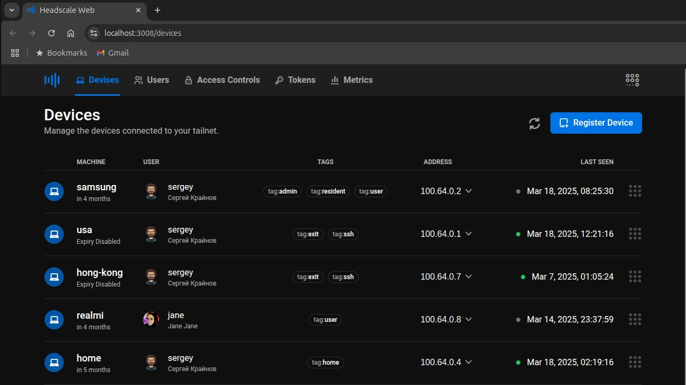

<p align="left" style="position: relative">
 
 <span style="color: #eee; font-size: 24px; font-weight: 600; ">Headscale Web UI</span>
</p>

A web frontend for the [headscale](https://github.com/juanfont/headscale) coordinator server.


[](https://hub.docker.com/r/sergeyitsib/headscale-web)
[](https://github.com/itsib/headscale-web/actions/workflows/main.yaml)



---

### Supported Features

- Very small size, **~30MB** docker image, with lighttpd server and files.
- Enable/Disable routes and exit nodes
- Add, move, rename, and remove nodes
- Add and remove users/namespaces
- Add and expire PreAuth keys
- Add and remove machine tags
- ACL access JSON file editor with syntax highlights
- Display Go server metrics
- Docker [image](https://hub.docker.com/r/sergeyitsib/headscale-web)
- Healthcheck in docker container

### Docker

The command below will download and run the image, which will be available at http://localhost:8080/

```shell
docker run -p 127.0.0.1:8080:80/tcp -d sergeyitsib/headscale-web
```

### Docker Compose

```yaml
services:
  headscale-web:
    image: sergeyitsib/headscale-web
    restart: unless-stopped
    ports:
      - '8081:80'
    healthcheck:
      test: ['CMD', 'healthcheck']
      interval: 10s
      timeout: 5s
      retries: 2
```

### Docker compose caddy with headscale metrics

```yaml
services:
  caddy:
    image: caddy
    restart: unless-stopped
    environment:
      - HS_DOMAIN=hs.am.itsib.su
    cap_add:
      - NET_ADMIN
    ports:
      - '0.0.0.0:80:80'
      - '0.0.0.0:443:443'
      - '0.0.0.0:443:443/udp'
    depends_on:
      - headscale
      - headscale-web
    sysctls:
      net.ipv4.ip_forward: 1
      net.ipv6.conf.all.forwarding: 1
    volumes:
      - ./caddy/Caddyfile:/etc/caddy/Caddyfile
      - caddy-data:/data
      - caddy-config:/config
  headscale-web:
    image: sergeyitsib/headscale-web:latest
    restart: unless-stopped
    environment:
      - PORT=8081
    healthcheck:
      test: ['CMD', 'healthcheck']
      interval: 10s
      timeout: 5s
      retries: 2

  headscale:
    container_name: headscale
    build:
      context: headscale
    volumes:
      - ./headscale/config:/etc/headscale
      - headscale-data:/var/lib/headscale
      - headscale-apikey:/usr/share/headscale
    healthcheck:
      test: ['CMD', 'healthcheck']
      interval: 10s
      timeout: 5s
      retries: 2
```

```Caddyfile
(cors) {
  header Access-Control-Allow-Origin *
  header Access-Control-Allow-Methods GET,POST,PUT,PATCH,HEAD,OPTIONS,DELETE
  header Access-Control-Allow-Headers Authorization,User-Agent,X-Requested-With,If-Modified-Since,Cache-Control,Content-Type

  @options method OPTIONS

  handle @options {
    header Access-Control-Max-Age 1728000
    header Content-Type text/plain; charset=utf-8
    header Content-Length 0

    respond 204
  }
}

(authorize) {
  @noauth not header Authorization Bearer*
  handle @noauth {
    respond "Unauthorized" 401
    abort
  }

  forward_auth headscale:8080 {
    uri /api/v1/user
    copy_headers Authorization
  }
}

example.com {
  reverse_proxy headscale-web:8081 {
    header_up Host {host}
  }
}

hs.example.com {
  import cors

  handle /metrics {
    import authorize

    reverse_proxy headscale:9090 {
      header_up Host {host}
    }
  }

  reverse_proxy headscale:8080 {
    header_up Host {host}
  }
}
```

### Build

Build for the production server.

```shell
# Cloning the repository
git clone git@github.com:itsib/headscale-web.git
# Change work dir
cd headscale-web

# Install dependencies
npm install

# Building production server
npm run build

# Start the vite server or use nginx in production
npm run preniew
```

### Development

After installing the dependencies (npm install), just run:

```shell
# Start the vite dev server
npm start
```
