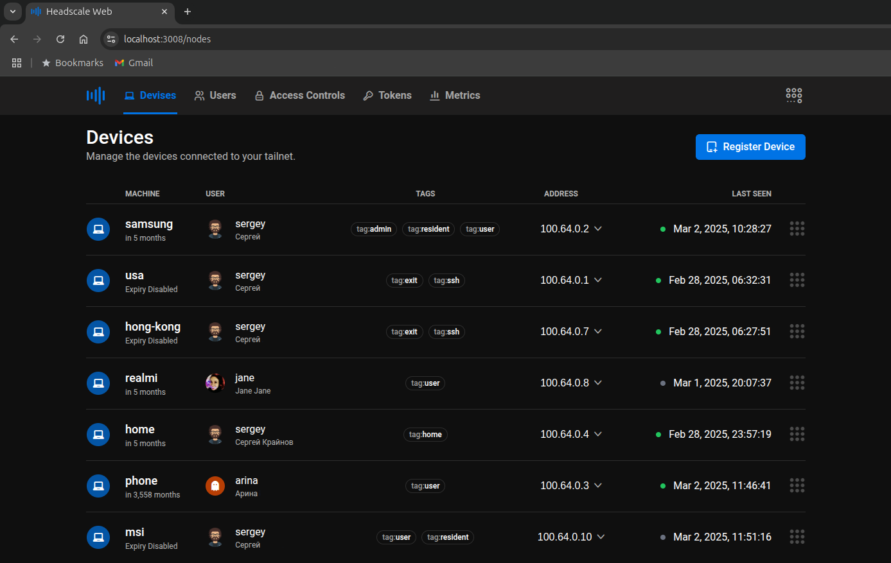

<p align="left" style="position: relative">
 
 <span style="color: #eee; font-size: 24px; font-weight: 600; ">Headscale Web UI</span>
</p>

A web frontend for the [headscale](https://github.com/juanfont/headscale) coordinator server.


[](https://hub.docker.com/r/sergeyitsib/headscale-web)
[](https://github.com/itsib/headscale-web/actions/workflows/main.yaml)




---

### Supported Features

-  Enable/Disable routes and exit nodes
-  Add, move, rename, and remove machines
-  Add and remove users/namespaces
-  Add and expire PreAuth keys
-  Add and remove machine tags
-  ACL access JSON file editor with syntax highlights
-  Display Go server metrics

### Build

Build for the production server.

```shell
# Cloning the repository
git clone git@github.com:itsib/headscale-web.git
# Change work dir
cd headscale-web

# Install dependencies
npm install

# Building production server
npm run build

# Start the vite server or use nginx in production
npm run preniew
```

### Development

After installing the dependencies (npm install), just run:

```shell
# Start the vite dev server
npm start
```

### Docker

You can also use a docker image. The command below will download and run the image, which will be available at http://localhost:8080/

```shell
docker run -p 127.0.0.1:8080:80/tcp -d sergeyitsib/headscale-web
```